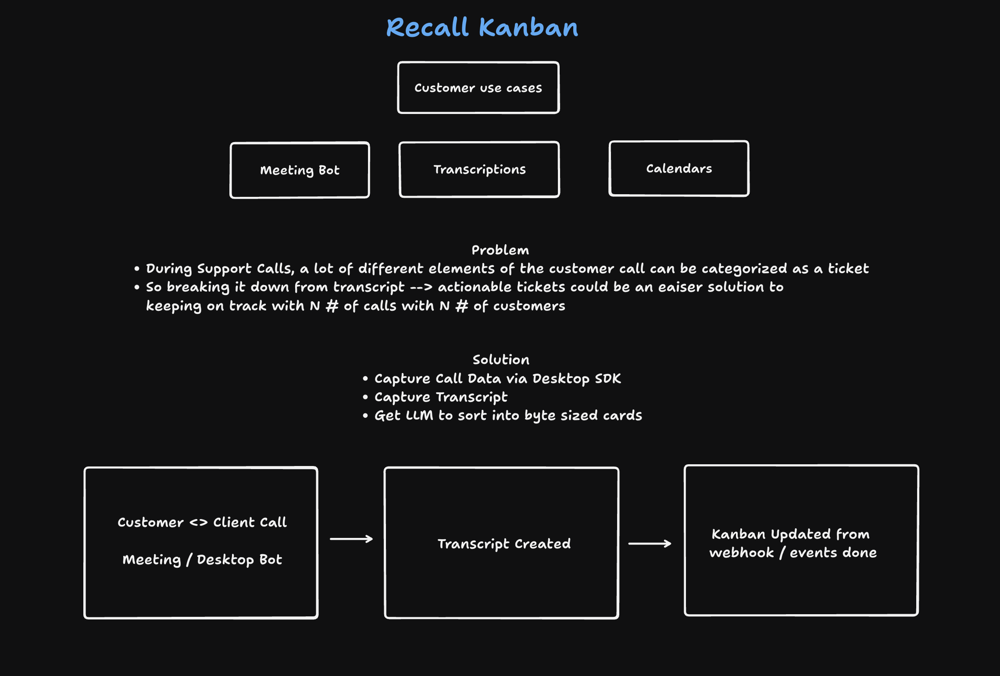
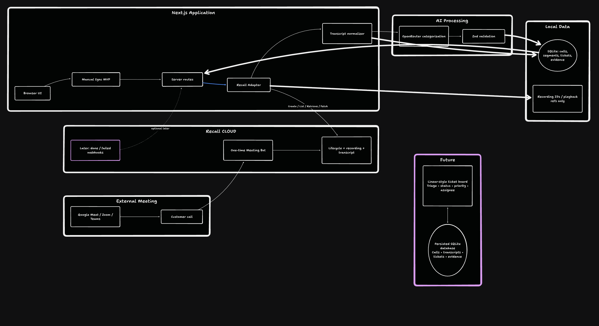

# Recall Kanban

- Meeting Bot 
- Transcript sorting
- Kanban sorting 

## Ideation
1. Spend a lot of time on customer understanding (case studies / general landscape)
2. Look through current Github Examples + Read through Docs 
3. Two ideas
    - AI voice coding agent inside meetings
    - Recall Kanban
4. Kanban seemed to test more of recall's architecture and is more of a template for teams which will be useful

## Architectng

1. TLDraw drawing (spending more time here)
    - Understand Meeting Bot flow
    - Test with a simple call between myself
    - Get Transcript
2. Paper MCP to draw up the designs
3. Get nextjs up and running
4. work on the ingestion of the transcripts

## Coding
1. Use my own skills
2. Connect to recall MCP + the agent skills
3. 

## Testing 
1. X

----

## Usage
//TODO fill with instructions for nextJS app