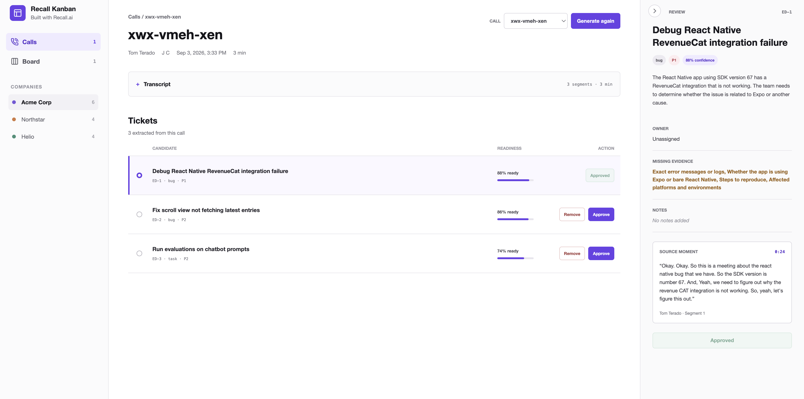

# Recall Kanban



## Ideation
1. Spend a lot of time on customer understanding (case studies / general landscape)
2. Look through current GitHub Examples + Read through Docs
3. Two ideas
    - AI voice coding agent inside meetings
    - Recall Kanban
4. Kanban seemed to test more of Recall's architecture and is more of a template for teams which will be useful
5. Small deep linking to Linear for approved board tickets.

## Architecting


- Meeting Bot
- Transcript sorting
- Kanban sorting


1. TLDraw drawing (spending more time here)
    - Understand Meeting Bot flow
    - Test with a simple call between myself
    - Get Transcript
2. Paper MCP to draw up the designs
3. Get Next.js up and running
4. Work on the ingestion of the transcripts

## Coding
1. Use my own skills
2. Connect to Recall MCP + the agent skills
3. Codex usage
4. More time on API calls + libs.

## Testing
1. Small tests for OpenRouter, Recall and DB syncing.

----

## Usage
Copy `.env.example` to `.env.local` and fill:

```sh
RECALL_API_KEY=
RECALL_REGION=us-west-2
OPENROUTER_API_KEY=
OPENROUTER_MODEL=openai/gpt-5.5 // can use other models.
```

Start Next.js:

```sh
npm i
npm run dev
```

Load every finished call in your Recall workspace. The first request against an empty store bootstraps automatically:

```sh
curl http://localhost:3000/api/calls                  # list calls (bootstraps on first use)
curl -X POST http://localhost:3000/api/recall/sync    # pull newly finished calls
curl http://localhost:3000/api/calls/{botId}          # one call with its transcript segments
curl -X POST -H 'content-type: application/json' \
  -d '{"force":false}' \
  http://localhost:3000/api/calls/{botId}/tickets/generate
```

For debugging a single bot without touching the store:

```sh
curl http://localhost:3000/api/recall/bots/{botId}/transcript
```

Run verification with `npm test`, `npm run lint`, and `npm run build -- --webpack`.
